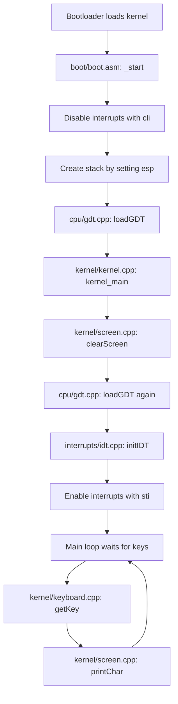
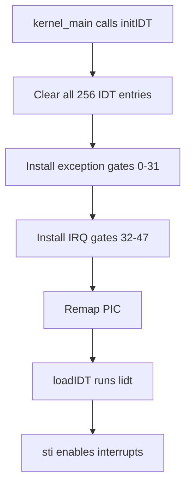
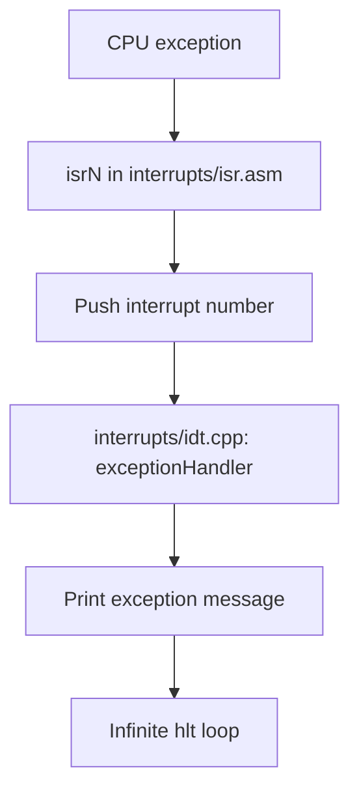
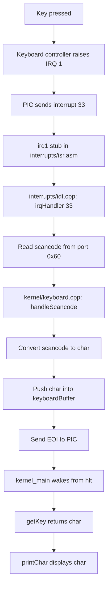
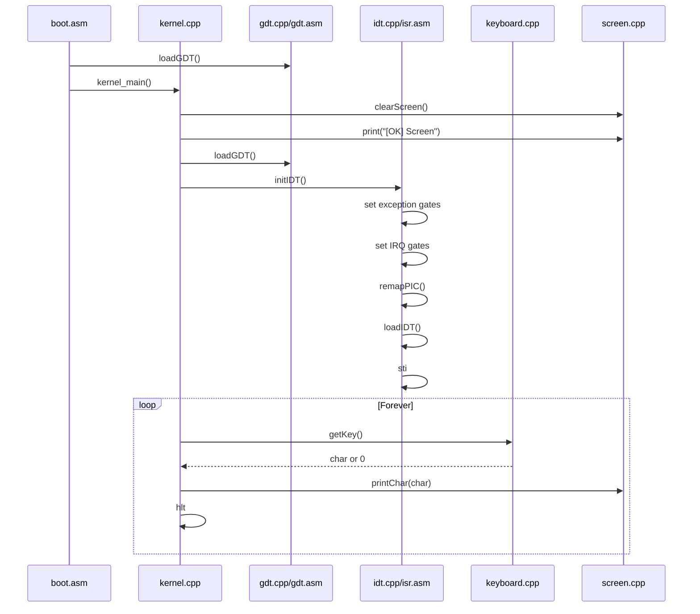

# myOS Code Walkthrough

`myOS` is a small 32-bit x86 hobby operating system kernel. It boots through a
Multiboot-compatible entry point, switches to kernel C++ code, writes directly to
VGA text memory, installs a Global Descriptor Table, installs an Interrupt
Descriptor Table, remaps the Programmable Interrupt Controller, and reads
keyboard input through IRQ 1.

## Project Structure

```text
myOS/
|-- boot/
|   `-- boot.asm              # Multiboot entry and early kernel setup
|-- cpu/
|   |-- gdt.asm               # Segment register reload after GDT load
|   |-- gdt.cpp               # GDT entries and loadGDT()
|   `-- gdt.h                 # GDT function declarations
|-- interrupts/
|   |-- idt.cpp               # IDT setup, PIC remap, exception/IRQ handlers
|   |-- idt.h                 # IDT initialization declaration
|   `-- isr.asm               # Assembly ISR/IRQ stubs and lidt wrapper
`-- kernel/
    |-- io.h                  # inb/outb port I/O helpers
    |-- kernel.cpp            # kernel_main() and main loop
    |-- keyboard.cpp          # Scancode to character buffer
    |-- keyboard.h            # Keyboard declarations
    |-- screen.cpp            # VGA text output
    `-- screen.h              # Screen declarations
```

## High-Level Workflow



## Boot Entry: `boot/boot.asm`

This file is the first code that runs after the bootloader transfers control to
the kernel.

Important blocks:

```asm
section .multiboot
align 4

dd 0x1BADB002
dd 0x00
dd -(0x1BADB002)
```

This creates the Multiboot header. The magic value tells a Multiboot bootloader
that this binary is a valid kernel image.

```asm
section .bss

align 16
stack_bottom:
    resb 16384
stack_top:
```

This reserves a 16 KiB stack. The stack grows downward, so the code starts the
stack pointer at `stack_top`.

```asm
_start:
    cli
    mov esp, stack_top
    call loadGDT
    call kernel_main
```

Workflow:

1. `cli` disables interrupts during early setup.
2. `mov esp, stack_top` initializes the stack pointer.
3. `call loadGDT` installs the Global Descriptor Table.
4. `call kernel_main` enters the C++ kernel.
5. If `kernel_main` ever returns, the CPU enters the `hang` loop.

## Kernel Main Loop: `kernel/kernel.cpp`

`kernel_main()` is the main C++ entry point:

```cpp
extern "C" void kernel_main()
{
    clearScreen();

    print("[OK] Screen\n");

    loadGDT();
    print("[OK] GDT\n");

    initIDT();
    print("[OK] IDT\n");

    print("[OK] Enter Main Loop\n");

    while(1)
    {
        char c = getKey();

        if(c)
        {
            printChar(c);
        }

        asm volatile("hlt");
    }
}
```

Function workflow:

1. `clearScreen()` clears VGA text memory.
2. `print()` writes status messages to the screen.
3. `loadGDT()` installs/reinstalls the kernel GDT.
4. `initIDT()` installs interrupt handlers and enables interrupts.
5. The infinite loop calls `getKey()`.
6. If a character is available, `printChar(c)` displays it.
7. `hlt` sleeps until the next interrupt.

The important idea is that keyboard input is not read directly in the main loop.
Instead, the keyboard interrupt handler fills a buffer, and the main loop drains
that buffer.

## Screen Output: `kernel/screen.cpp` and `kernel/screen.h`

The screen code writes directly to VGA text mode memory at address `0xB8000`.

```cpp
unsigned short* videoMemory = (unsigned short*)0xB8000;

int cursorX = 0;
int cursorY = 0;
```

Each VGA text cell is two bytes:

- low byte: ASCII character
- high byte: color attribute

The code uses:

```cpp
static const int VGA_WIDTH = 80;
static const int VGA_HEIGHT = 25;
static const int VGA_COLOR = 0x02; // Green text on black background
```

### `clearScreen()`

File: `kernel/screen.cpp`

```cpp
void clearScreen()
{
    for (int y = 0; y < VGA_HEIGHT; y++)
    {
        for (int x = 0; x < VGA_WIDTH; x++)
        {
            videoMemory[y * VGA_WIDTH + x] = (VGA_COLOR << 8) | ' ';
        }
    }

    cursorX = 0;
    cursorY = 0;
}
```

Purpose:

- fills every screen cell with a blank space
- keeps the configured color
- resets the cursor to the top-left corner

### `printChar(char c)`

File: `kernel/screen.cpp`

```cpp
void printChar(char c)
{
    if (c == '\n')
    {
        cursorX = 0;
        cursorY++;
        ...
        return;
    }

    videoMemory[cursorY * VGA_WIDTH + cursorX] =
        (VGA_COLOR << 8) | c;

    cursorX++;
    ...
}
```

Purpose:

- handles newline by moving to the next row
- writes a normal character into VGA memory
- advances the cursor
- wraps to the next line when `cursorX` reaches `80`
- wraps back to the top when `cursorY` reaches `25`

Current behavior note: the screen wraps to the top instead of scrolling.

### `print(const char* str)`

File: `kernel/screen.cpp`

```cpp
void print(const char* str)
{
    int i = 0;

    while (str[i] != '\0')
    {
        printChar(str[i]);
        i++;
    }
}
```

Purpose:

- loops through a null-terminated C string
- prints each character using `printChar`

## Global Descriptor Table: `cpu/gdt.cpp`, `cpu/gdt.asm`, `cpu/gdt.h`

The GDT defines the memory segments used by the CPU in protected mode. This
kernel creates three descriptors:

```text
Index  Selector  Meaning
0      0x00      Null descriptor
1      0x08      Kernel code segment
2      0x10      Kernel data segment
```

### Data Structures

File: `cpu/gdt.cpp`

```cpp
struct GDTEntry
{
    unsigned short limitLow;
    unsigned short baseLow;
    unsigned char baseMiddle;
    unsigned char access;
    unsigned char granularity;
    unsigned char baseHigh;
} __attribute__((packed));
```

`GDTEntry` must match the exact hardware layout expected by `lgdt`, so it is
marked `packed`.

```cpp
struct GDTPointer
{
    unsigned short limit;
    unsigned int base;
} __attribute__((packed));
```

`GDTPointer` is the descriptor-table pointer loaded by the `lgdt` instruction.

### `setGDTEntry(...)`

File: `cpu/gdt.cpp`

```cpp
static void setGDTEntry(
    int num,
    unsigned int base,
    unsigned int limit,
    unsigned char access,
    unsigned char granularity)
```

Purpose:

- splits a 32-bit base address into low, middle, and high fields
- splits the segment limit into the proper GDT fields
- stores access and granularity flags

### `loadGDT()`

File: `cpu/gdt.cpp`

```cpp
extern "C" void loadGDT()
{
    gdtPtr.limit = (sizeof(GDTEntry) * 3) - 1;
    gdtPtr.base = (unsigned int)&gdt;

    setGDTEntry(0, 0, 0, 0, 0);
    setGDTEntry(1, 0, 0xFFFFFFFF, 0x9A, 0xCF);
    setGDTEntry(2, 0, 0xFFFFFFFF, 0x92, 0xCF);

    asm volatile("lgdt (%0)" : : "r"(&gdtPtr));

    gdtFlush();
}
```

Workflow:

1. Build a `GDTPointer`.
2. Create the null descriptor.
3. Create a flat 32-bit code segment.
4. Create a flat 32-bit data segment.
5. Load the table using `lgdt`.
6. Call `gdtFlush()` to reload segment registers.

### `gdtFlush()`

File: `cpu/gdt.asm`

```asm
gdtFlush:
    mov ax, 0x10
    mov ds, ax
    mov es, ax
    mov fs, ax
    mov gs, ax
    mov ss, ax

    jmp 0x08:flush

flush:
    ret
```

Purpose:

- loads data segment selector `0x10` into `ds`, `es`, `fs`, `gs`, and `ss`
- performs a far jump to code selector `0x08`
- returns to the caller after the CPU is using the new segment descriptors

## Interrupt Descriptor Table: `interrupts/idt.cpp`, `interrupts/isr.asm`, `interrupts/idt.h`

The IDT maps CPU exceptions and hardware interrupts to handler functions.



### IDT Structures

File: `interrupts/idt.cpp`

```cpp
struct IDTEntry
{
    unsigned short offsetLow;
    unsigned short selector;
    unsigned char zero;
    unsigned char typeAttr;
    unsigned short offsetHigh;
} __attribute__((packed));
```

Each IDT entry points to an interrupt handler. Like GDT entries, this structure
must match the CPU layout exactly.

```cpp
struct IDTPointer
{
    unsigned short limit;
    unsigned int base;
} __attribute__((packed));
```

This is passed to the CPU with `lidt`.

### `setIDTGate(int n, unsigned int handler)`

File: `interrupts/idt.cpp`

```cpp
void setIDTGate(int n, unsigned int handler)
{
    idt[n].offsetLow = handler & 0xFFFF;
    idt[n].selector = 0x08;
    idt[n].zero = 0;
    idt[n].typeAttr = 0x8E;
    idt[n].offsetHigh = (handler >> 16) & 0xFFFF;
}
```

Purpose:

- stores the handler address in low/high parts
- uses code segment selector `0x08`
- uses type attribute `0x8E`, which represents a present 32-bit interrupt gate

### `remapPIC()`

File: `interrupts/idt.cpp`

```cpp
void remapPIC()
{
    outb(0x20, 0x11);
    outb(0xA0, 0x11);

    outb(0x21, 0x20);
    outb(0xA1, 0x28);
    ...

    outb(0x21, 0xFD);
    outb(0xA1, 0xFF);
}
```

Purpose:

- moves hardware IRQs away from CPU exception vectors
- maps master PIC IRQs to interrupt numbers `32-39`
- maps slave PIC IRQs to interrupt numbers `40-47`
- unmasks only keyboard IRQ 1 with `0xFD`
- masks all slave PIC IRQs with `0xFF`

### `initIDT()`

File: `interrupts/idt.cpp`

Main responsibilities:

1. Create an `IDTPointer`.
2. Clear all 256 entries.
3. Register `isr0` through `isr31` for CPU exceptions.
4. Register `irq0` through `irq15` for hardware interrupts.
5. Remap the PIC.
6. Load the IDT using `loadIDT`.
7. Enable interrupts using `sti`.

### ISR and IRQ Stubs

File: `interrupts/isr.asm`

The file uses NASM macros to generate many small assembly handlers.

```asm
%macro ISR_NOERR 1

global isr%1

isr%1:
    cli
    pusha
    push dword %1
    call exceptionHandler
    add esp, 4
    popa
    iretd

%endmacro
```

Each exception stub:

- disables interrupts
- saves general-purpose registers with `pusha`
- pushes the interrupt number
- calls `exceptionHandler`
- restores registers
- returns with `iretd`

```asm
%macro IRQ 2

global irq%1

irq%1:
    pusha
    push dword %2
    call irqHandler
    add esp, 4
    popa
    iretd

%endmacro
```

Each IRQ stub:

- saves registers
- pushes the remapped interrupt number
- calls `irqHandler`
- restores registers
- returns with `iretd`

### `loadIDT`

File: `interrupts/isr.asm`

```asm
loadIDT:
    mov eax, [esp + 4]
    lidt [eax]
    ret
```

Purpose:

- receives a pointer argument from C++
- loads the IDT register using `lidt`

## Exception Handling

File: `interrupts/idt.cpp`

```cpp
extern "C" void exceptionHandler(int interruptNumber)
{
    print("\nEXCEPTION: ");
    print(exceptionMessages[interruptNumber]);
    print("\n");

    while (1)
    {
        asm volatile("hlt");
    }
}
```

Workflow:

1. An exception occurs.
2. The matching `isrN` assembly stub runs.
3. The stub calls `exceptionHandler(N)`.
4. The handler prints the exception name.
5. The kernel halts forever.



## IRQ and Keyboard Workflow

Hardware interrupts use `irqHandler()` in `interrupts/idt.cpp`.

```cpp
extern "C" void irqHandler(int interruptNumber)
{
    print("\nIRQ ");

    if (interruptNumber == 32)
    {
        print("TIMER");
    }
    else if (interruptNumber == 33)
    {
        print("KEYBOARD");

        unsigned char scancode = inb(0x60);

        handleScancode(scancode);
    }
    ...

    outb(0x20, 0x20);
}
```

Keyboard workflow:



Important details:

- keyboard data is read with `inb(0x60)`
- only key press scancodes are handled
- key release scancodes are ignored with `if (scancode & 0x80)`
- characters are pushed into a circular buffer
- `kernel_main()` prints buffered characters later

## Keyboard Buffer: `kernel/keyboard.cpp` and `kernel/keyboard.h`

The keyboard code translates raw scancodes into ASCII characters.

```cpp
static char keyboardBuffer[256];

static int bufferHead = 0;
static int bufferTail = 0;
```

This is a circular buffer:

- `bufferTail` moves when a character is added
- `bufferHead` moves when a character is read
- modulo `256` wraps the indexes around the array

### `pushKey(char c)`

File: `kernel/keyboard.cpp`

```cpp
static void pushKey(char c)
{
    keyboardBuffer[bufferTail] = c;

    bufferTail =
        (bufferTail + 1) % 256;
}
```

Purpose:

- inserts one character into the keyboard buffer
- advances `bufferTail`

Current behavior note: this function does not check for buffer overflow. If too
many keys arrive before `getKey()` reads them, old unread data can be
overwritten.

### `getKey()`

File: `kernel/keyboard.cpp`

```cpp
char getKey()
{
    if (bufferHead == bufferTail)
    {
        return 0;
    }

    char c = keyboardBuffer[bufferHead];

    bufferHead =
        (bufferHead + 1) % 256;

    return c;
}
```

Purpose:

- returns `0` if the buffer is empty
- otherwise returns the next buffered character
- advances `bufferHead`

### `handleScancode(unsigned char scancode)`

File: `kernel/keyboard.cpp`

```cpp
void handleScancode(unsigned char scancode)
{
    if (scancode & 0x80)
    {
        return;
    }

    char c = scancodeTable[scancode];

    if (c)
    {
        pushKey(c);
    }
}
```

Purpose:

- ignores key release events
- converts the scancode into an ASCII character using `scancodeTable`
- pushes valid characters into the keyboard buffer

Current behavior note: the table supports simple unshifted keys only. Shift,
Caps Lock, Ctrl, Alt, arrows, and extended scancodes are not handled yet.

## Port I/O Helpers: `kernel/io.h`

This header contains small inline wrappers for CPU port I/O instructions.

```cpp
static inline unsigned char inb(unsigned short port)
{
    unsigned char result;

    asm volatile("inb %1, %0" : "=a"(result) : "Nd"(port));

    return result;
}
```

`inb()` reads one byte from an I/O port.

```cpp
static inline void outb(unsigned short port, unsigned char data)
{
    asm volatile("outb %0, %1" : : "a"(data), "Nd"(port));
}
```

`outb()` writes one byte to an I/O port.

Used by:

- `interrupts/idt.cpp` to configure the PIC
- `interrupts/idt.cpp` to read keyboard data from port `0x60`
- `interrupts/idt.cpp` to send End Of Interrupt commands

## Runtime Flow Summary



## Important Current Limitations

- The VGA screen wraps to the top instead of scrolling.
- Keyboard support is limited to a simple unshifted scancode table.
- The keyboard circular buffer does not detect full-buffer overflow.
- The ISR macro treats every CPU exception as if it has no CPU-pushed error
  code, but some x86 exceptions do push an error code.
- IRQ output prints `IRQ KEYBOARD` on every key interrupt, so typed text is
  mixed with debug interrupt messages.
- The PIC mask enables keyboard IRQ only; timer and most other hardware IRQs are
  masked.

## Good Next Files To Study

Recommended reading order:

1. `boot/boot.asm`
2. `kernel/kernel.cpp`
3. `kernel/screen.cpp`
4. `cpu/gdt.cpp`
5. `cpu/gdt.asm`
6. `interrupts/idt.cpp`
7. `interrupts/isr.asm`
8. `kernel/keyboard.cpp`
9. `kernel/io.h`

This order follows the same path the CPU and kernel follow at runtime.
